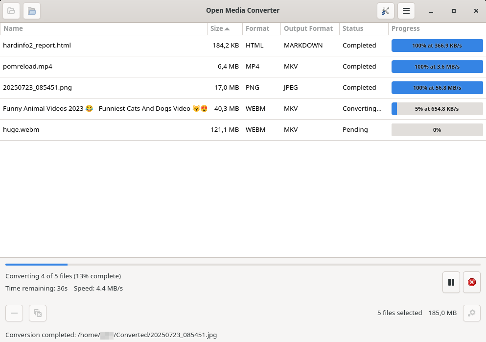

# Open Media Converter

[](https://github.com/albilu/open-media-converter/actions/workflows/ci-cd.yml) [](https://github.com/albilu/open-media-converter/actions/workflows/codeql.yml)

A fully featured GUI (GTK 4 via java-gi) Linux app to convert video, audio, image and document formats using (FFmpeg, ImageMagick, Pandoc, LibreOffice).



## Quick highlights

-   Multi-format conversions: video, audio, image, documents
-   Batch processing with per-file progress and presets
-   Portable AppImage or native DEB package
-   Bundles verified FFmpeg, ffprobe and Pandoc executables by default

## Get the app

-   Releases: https://github.com/albilu/open-media-converter/releases

Quick examples:

-   Run the AppImage:

    ```bash
    chmod +x Open_Media_Converter-*.AppImage
    ./Open_Media_Converter-*.AppImage
    ```

-   Install DEB on Debian/Ubuntu:

    ```bash
    sudo dpkg -i open-media-converter_*.deb
    sudo apt-get install -f
    ```

## Build from source (short)

Prerequisites: Java 23+, Maven 3.8+, Python 3.11+, and GTK 4. Install ImageMagick
for images and LibreOffice for native Office conversions and PDF rendering.

```bash
mvn clean package
omc-gtk/bin/open-media-converter
```

The first build downloads pinned FFmpeg and Pandoc archives for Linux x86_64 or
aarch64, verifies their SHA-256 checksums, and includes the executables and license
information in the application JAR. Later offline builds can reuse
`omc-gtk/.tool-cache/`. Versions and sources are recorded in
[`omc-gtk/packaging/tools.json`](omc-gtk/packaging/tools.json) and
[`BINARY_LICENSES.md`](BINARY_LICENSES.md).

For a smaller build that uses installed converters:

```bash
mvn clean package -Domc.skipEmbeddedTools=true
```

Unavailable converters disable the corresponding settings sections; the
application can still launch. Text-to-PDF conversion requires LibreOffice.

Docker Build, test, dev, and run:

```bash
make compile
make test
make dev
make run
```

See `omc-gtk/scripts/` and `omc-gtk/packaging/` for packaging helpers (AppImage / DEB).

## Usage overview

1. Add files or folders in the UI.
2. Select or create a preset in **Settings**.
3. Click **Convert** to start a batch.
4. Monitor per-file progress and open the output folder when finished.

Each Video, Audio, Image and Document section has its own output format, settings
and saved presets. Right-click a file to apply a section preset or custom settings;
the file list indicates the override. Window size, maximized/fullscreen state,
file records, per-file settings and section settings are restored on restart.

Video and audio use container-compatible FFmpeg codecs. Images support fit, fill,
stretch, resampling filters, rotation, flipping and PNG compression. SVG exports
contain the transformed raster image; they do not trace it into vector paths.

Document routing considers both formats: Pandoc handles supported text/editable
document pairs, while LibreOffice handles native word-processing, spreadsheet
and presentation formats. PDF is an export format; PDF-to-editable-document
conversion is unsupported. Applicable document exports support margins, templates,
formatting removal, contents tables and PDF font embedding. Native Office paths
preserve source layout and report unsupported custom text-layout options.

See the [feature remediation report](docs/feature-remediation.md) for verified
workflows, regression commands and platform coverage.

## Troubleshooting & docs

Short troubleshooting is in [`docs/troubleshooting.md`](docs/troubleshooting.md). For more details see the [`docs/`](docs/) folder.

If you hit a problem, enable debug logging and check logs:

```bash
# GUI/AppImage
OMC_DEBUG=1 ./Open_Media_Converter-*.AppImage
# Logs
~/.local/share/open-media-converter/logs/
```

## Contributing

Contributions are welcome. Please:

1. Open an issue describing the change or bug.
2. Fork the repo and create a branch for your work.
3. Run tests: `mvn test` and keep changes small and focused.
