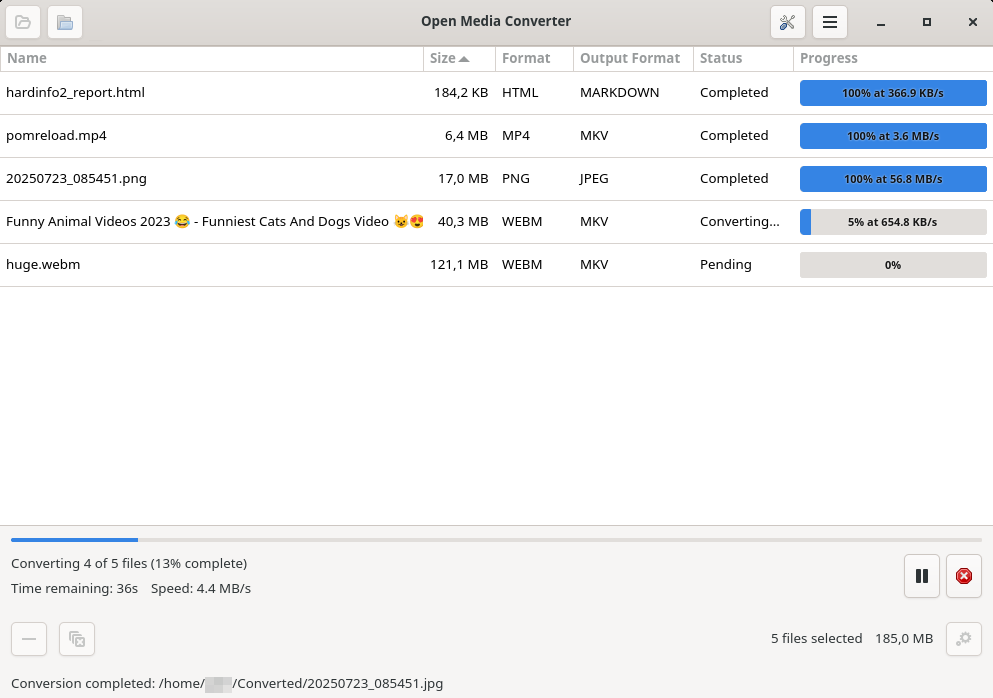

# Open Media Converter

[](https://github.com/albilu/open-media-converter/actions/workflows/test-ci.yml)
[](https://github.com/albilu/open-media-converter/actions/workflows/release-ci.yml)
[](https://github.com/albilu/open-media-converter/releases)
[](LICENSE)
[](pom.xml)
[](packaging/)

> A native GTK4 media converter for Linux, with one queue for video, audio, images and documents.

Open Media Converter (OMC) brings FFmpeg, ImageMagick, Pandoc and LibreOffice into
one desktop application with batch controls, reusable presets and persistent settings.

[Features](#features) · [Installation](#installation) · [Usage](#usage) · [Building from source](#building-from-source) · [Troubleshooting](#troubleshooting)



## Features

- Video and audio conversion with format-compatible codecs and quality controls
- Image resizing, rotation, flipping, resampling and compression
- Document conversion and PDF export
- Batch conversion with configurable parallelism
- Pause and resume running conversion processes, or cancel a batch
- Separate video, audio, image and document presets
- Per-file presets and custom settings alongside batch defaults
- File and folder import, with per-file status and progress
- Session restoration, including file records, settings and window state
- System-managed conversion tools in native packages; bundled FFmpeg, ffprobe
  and Pandoc in AppImage

| Content | Engine | Supported formats |
|---|---|---|
| Video | FFmpeg | MP4 (.mp4, .m4v), AVI, MOV (.mov, .qt), MKV, WMV, FLV, WebM |
| Audio | FFmpeg | MP3, WAV, FLAC, AAC, Ogg (.ogg, .oga), M4A |
| Images | ImageMagick | JPEG (.jpg, .jpeg, .jpe), PNG, GIF, BMP (.bmp, .dib), TIFF (.tiff, .tif), WebP, SVG, PDF export |
| Documents | Pandoc / LibreOffice | DOC, DOCX, ODT, RTF, TXT, HTML (.html, .htm), Markdown (.md, .markdown), EPUB, LaTeX (.tex, .latex), reStructuredText (.rst), Org (.org), CSV, XLS, XLSX, ODS, PPT, PPTX, ODP, PDF export |

Available conversions depend on the input/output pair and installed tools.
PDF-to-editable-document conversion is unsupported. SVG exports contain a raster
image; they do not trace vector paths.

## Installation

Download packages from [GitHub Releases](https://github.com/albilu/open-media-converter/releases).

Packages target Linux x86_64 and include a trimmed Java 23 runtime. A separate
Java installation is not required.

<details>
<summary>Requirements</summary>

- GTK 4.10 or newer for native packages; the AppImage includes GTK libraries
- Ubuntu 22.04 or newer, or a compatible Linux desktop with glibc 2.35+, for AppImage
- FFmpeg 6.1 or newer (including ffprobe) and Pandoc 3.1 or newer for native packages
- ImageMagick for image conversions
- LibreOffice, including the relevant Writer, Calc or Impress components, for
  Office documents and PDF rendering

Native package managers resolve the declared system dependencies. ImageMagick
and LibreOffice remain host dependencies for the AppImage.

Codec availability depends on the installed FFmpeg build. The RPM requires the
full `ffmpeg` package for codecs such as H.264 (`libx264`); Fedora's
[`ffmpeg-free`](https://packages.fedoraproject.org/pkgs/ffmpeg/ffmpeg-free/) has
limited codec support. Enable a repository providing full FFmpeg, such as
[RPM Fusion](https://rpmfusion.org/Configuration), before installing the RPM.

</details>

```sh
# Debian / Ubuntu
sudo apt install ./open-media-converter_*_amd64.deb

# Fedora / RHEL
sudo dnf install ./open-media-converter-*.x86_64.rpm

# Arch Linux
sudo pacman -U ./open-media-converter-*-x86_64.pkg.tar.zst

# AppImage
chmod +x Open_Media_Converter-*-x86_64.AppImage
./Open_Media_Converter-*-x86_64.AppImage
```

## Usage

1. Add files or folders to the queue.
2. Open **Settings** to choose output formats, conversion options and presets.
3. Right-click a file to apply a preset or custom settings to that file.
4. Click **Convert**, then use **Pause**, **Resume** or **Cancel** as needed.
5. Open the output folder when the batch finishes.


## Building from source

The supported development environment uses Docker. From the repository root:

```sh
make build     # Build the omc-dev image
make compile   # Compile and package the application
make test      # Run the test suite under Xvfb
make package   # Build all four package formats into packaging/dist/
make dev       # Open an interactive development container
make run       # Launch with GUI forwarding
make debug     # Launch with a suspended debugger on port 5005
```

For a host build, install JDK 23, Maven 3.8+, Python 3.11+, GTK4 and the required
conversion tools:

```sh
mvn clean package
omc-gtk/bin/open-media-converter
```

The first default Maven build downloads checksum-verified FFmpeg and Pandoc archives for the
host's Linux x86_64 or aarch64 architecture. Later builds reuse
`omc-gtk/.tool-cache/`. See the [tool manifest](omc-gtk/scripts/tools.json) and
[binary licenses](BINARY_LICENSES.md) for bundled versions and sources.
Use `mvn clean package -Domc.skipEmbeddedTools=true` for a smaller build that
requires installed converters. `make package` automatically builds a clean,
unbundled JAR for DEB/RPM/Arch, then a bundled JAR for AppImage; no extra flag is
needed. Distribution packaging targets x86_64.

## Troubleshooting

If a converter is unavailable, OMC disables the corresponding settings section.
Install or configure the missing tool; text-to-PDF export also needs LibreOffice.

Enable detailed logging with either command:

```sh
open-media-converter --debug
OMC_DEBUG=1 ./Open_Media_Converter-*-x86_64.AppImage
```

Logs are saved under `${XDG_STATE_HOME:-$HOME/.local/state}/open-media-converter/logs/`:
`app.log`, `conversion.log` and `error.log`. Use `OMC_LOG_DIR` for an exact directory
override (`LOG_DIR` is also accepted). Logging defaults to INFO; `OMC_LOG_LEVEL`
selects an explicit level such as TRACE or WARN, and `--debug` takes precedence.
Direct JVM launches can use `-Domc.logging.level=LEVEL` to override `OMC_LOG_LEVEL`.

Logs rotate daily or at 2 MB into gzip archives, kept for seven days with a 12 MB
archive cap per log. Conversion logging is synchronous and closes on exit.
Older logs in `~/.local/share/open-media-converter/logs/` remain in that directory.

When [reporting a problem](https://github.com/albilu/open-media-converter/issues),
include the app version, Linux distribution, conversion settings, steps to
reproduce and relevant logs.

## Powered by

- [FFmpeg](https://ffmpeg.org/) for video/audio conversion and media probing
- [ImageMagick](https://imagemagick.org/) for image conversion and transformations
- [Pandoc](https://pandoc.org/) for document format conversion
- [LibreOffice](https://www.libreoffice.org/) for Office formats and PDF rendering
- [GTK](https://www.gtk.org/) and [java-gi](https://github.com/jwharm/java-gi) for the native desktop interface

## Contributing

Open an [issue](https://github.com/albilu/open-media-converter/issues) or submit a
focused pull request. Run `make test` before submitting changes; packaging changes
should also pass the package verifier. OMC is licensed under the [GNU GPL v3](LICENSE).
